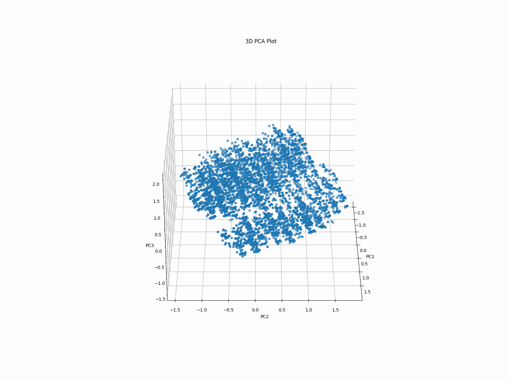
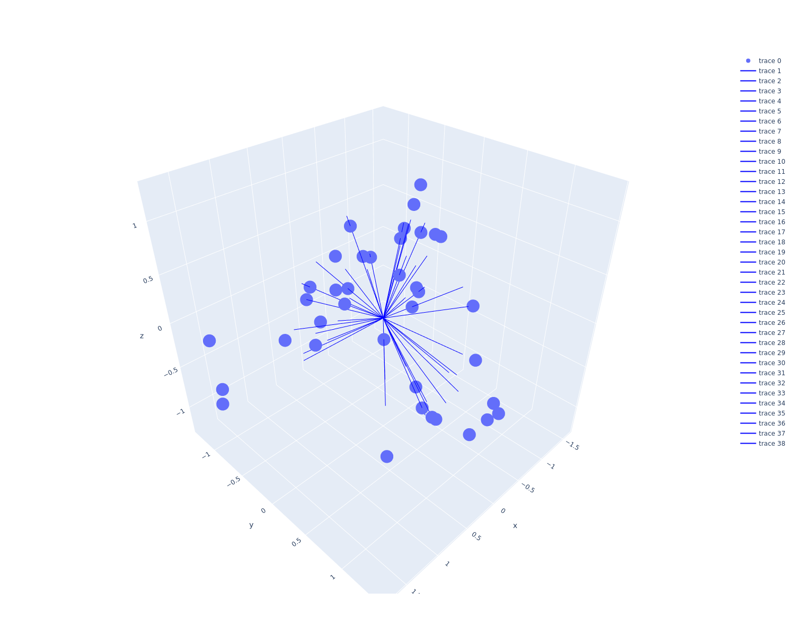
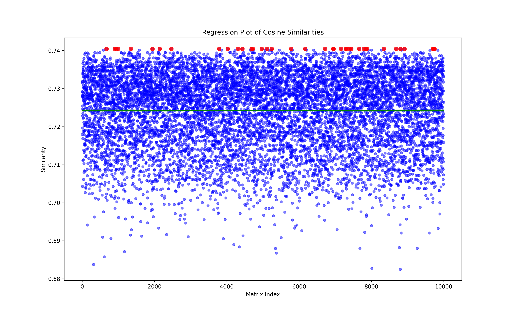

# pyMigSim
`DivMigrate` was run based on the script by `Sundqvist et al. (2016)`, as described in the paper: `https://www.ncbi.nlm.nih.gov/pmc/articles/PMC4842207/`. To enhance the analysis for the study, I have used Python programming to independently run simulations and determine the best scenario for choosing an analysis. <br/>  
The DivMigrate simulation in Python (`pyMigSim`) runs `1,000-10,000` replications to select the highest values, employing cosine distance calculation. The method computes the cosine distance between two vectors in 3D spatial using the SciPy module in Python. <br/>
 
To run the simulation: <br/>
- Execute migration using DivMigrate in RStudio (`python pyDivMigSim.py <R_script> <genpop_file> <method [nm|d|g]> <simulation>`)
- Determine the highest value of the simulation number using cosine distance and selecting all the candidate's simulation running (`python SIMcos_DivMigrate.py <method [nm|d|g]> <simulation>`)
- Compute statistics of `OLS (Ordinary least-squares)` for all the best simulations to select the optimal one


# Installing requirements
```
Rstudio 4.2.2
r-diveRsity
python 3.8.15
numpy
pandas
seaborn
matplotlib
scipy
statsmodels
sklearn
mpl_toolkits
plotly
imageio
```
# Demo running
- All cosine distance in 3D plot <br/>
 <br/>
- The candidate simulations for choosing based on the highest similarities <br/>
 <br/>
- Plotting the regression from all dataset <br/>
 <br/>
- Choosing the final simulation between the candidate sims use OLS model <br/>
```
Results: Ordinary least squares
======================================================================
Model:               OLS               Adj. R-squared:      -inf      
Dependent Variable:  const             AIC:                 -3349.4865
Date:                2024-04-23 05:09  BIC:                 -3345.7028
No. Observations:    49                Log-Likelihood:      1676.7    
Df Model:            1                 F-statistic:         -47.00    
Df Residuals:        47                Prob (F-statistic):  1.00      
R-squared:           -inf              Scale:               1.1565e-31
----------------------------------------------------------------------
          Coef.  Std.Err.           t            P>|t|   [0.025 0.975]
----------------------------------------------------------------------
const     1.0000   0.0000 15882837056526484.0000 0.0000  1.0000 1.0000
sim_7660  0.0000   0.0000                 2.4905 0.0163  0.0000 0.0000
sim_7444  0.0000   0.0000                 0.0623 0.9506 -0.0000 0.0000
sim_4722  0.0000   0.0000                 0.0623 0.9506 -0.0000 0.0000
sim_5246  0.0000   0.0000                 0.0623 0.9506 -0.0000 0.0000
sim_9702  0.0000   0.0000                 0.0623 0.9506 -0.0000 0.0000
sim_9716  0.0000   0.0000                 0.0623 0.9506 -0.0000 0.0000
sim_4689  0.0000   0.0000                 0.0623 0.9506 -0.0000 0.0000
sim_8344  0.0000   0.0000                 0.0623 0.9506 -0.0000 0.0000
sim_8805  0.0000   0.0000                 0.0623 0.9506 -0.0000 0.0000
sim_7160  0.0000   0.0000                 0.0623 0.9506 -0.0000 0.0000
sim_5781  0.0000   0.0000                 0.0623 0.9506 -0.0000 0.0000
sim_4431  0.0000   0.0000                 0.0623 0.9506 -0.0000 0.0000
sim_6719  0.0000   0.0000                 0.0623 0.9506 -0.0000 0.0000
sim_993   0.0000   0.0000                 0.0623 0.9506 -0.0000 0.0000
sim_2465  0.0000   0.0000                 0.0623 0.9506 -0.0000 0.0000
sim_8684  0.0000   0.0000                 0.0623 0.9506 -0.0000 0.0000
sim_4309  0.0000   0.0000                 0.0623 0.9506 -0.0000 0.0000
sim_3791  0.0000   0.0000                 0.0623 0.9506 -0.0000 0.0000
sim_1943  0.0000   0.0000                 0.0623 0.9506 -0.0000 0.0000
sim_9745  0.0000   0.0000                 0.0623 0.9506 -0.0000 0.0000
sim_674   0.0000   0.0000                 0.0623 0.9506 -0.0000 0.0000
sim_4027  0.0000   0.0000                 0.0623 0.9506 -0.0000 0.0000
sim_7401  0.0000   0.0000                 0.0623 0.9506 -0.0000 0.0000
sim_7294  0.0000   0.0000                 0.0623 0.9506 -0.0000 0.0000
sim_7877  0.0000   0.0000                 0.0623 0.9506 -0.0000 0.0000
sim_2144  0.0000   0.0000                 0.0623 0.9506 -0.0000 0.0000
sim_7306  0.0000   0.0000                 0.0623 0.9506 -0.0000 0.0000
sim_941   0.0000   0.0000                 0.0623 0.9506 -0.0000 0.0000
sim_7792  0.0000   0.0000                 0.0623 0.9506 -0.0000 0.0000
sim_899   0.0000   0.0000                 0.0623 0.9506 -0.0000 0.0000
sim_8918  0.0000   0.0000                 0.0623 0.9506 -0.0000 0.0000
sim_1347  0.0000   0.0000                 0.0623 0.9506 -0.0000 0.0000
sim_6957  0.0000   0.0000                 0.0623 0.9506 -0.0000 0.0000
sim_4968  0.0000   0.0000                 0.0623 0.9506 -0.0000 0.0000
sim_6946  0.0000   0.0000                 0.0623 0.9506 -0.0000 0.0000
sim_5116 -0.0000   0.0000                -0.1868 0.8526 -0.0000 0.0000
sim_6169 -0.0000   0.0000                -0.1868 0.8526 -0.0000 0.0000
sim_7849  0.0000   0.0000                 0.0623 0.9506 -0.0000 0.0000
----------------------------------------------------------------------
Omnibus:             nan      Durbin-Watson:         0.000            
Prob(Omnibus):       nan      Jarque-Bera (JB):      nan              
Skew:                nan      Prob(JB):              nan              
Kurtosis:            nan      Condition No.:         13292482535527436
======================================================================
Notes:
[1] Standard Errors assume that the covariance matrix of the errors is
correctly specified.
[2] The smallest eigenvalue is 2.51e-30. This might indicate that
there are strong multicollinearity problems or that the design
matrix is singular.
###########################
Your final simulation after running OLS was:
Coefficients    8.673617e-18
Name: sim_7660, dtype: float64
```

# Paper applied
`Genome-wide SNP analyses reveal high gene flow of endemic Smallscale Croaker (Boesemania microlepis) in the Lower Mekong Basin (2024)` <br/>
```
Quyen Dang Ha Vu (quyenvdh@ntu.edu.vn), Binh Thuy Dang (binhdt@ntu.edu.vn), Oanh Thi Truong (oanhtt@ntu.edu.vn), Sang Quang Tran (sangtq@ntu.edu.vn), Bird E. Christopher (chris.bird@tamucc.edu), Kent Carpenter (kcarpent@odu.edu), Biesack E. Ellen (ebies001@odu.edu), Ackiss S. Amanda (aacki002@odu.edu)
```

# Contact
############################################ <br/>
Tsang - Sang Tran Quang <br/>
PhD student <br/>
Molecular Bioinformatics <br/>
Nha Trang University <br/>
sangtq@ntu.edu.vn <br/>
Khanh Hoa, Vietnam <br/>
############################################ <br/>
